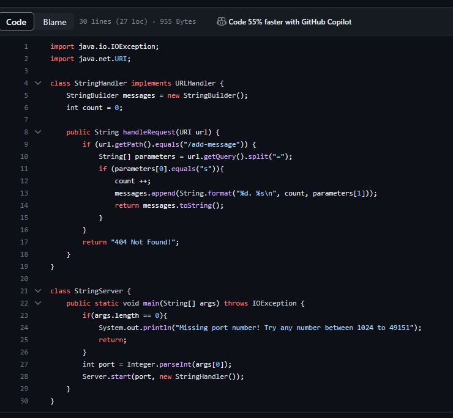
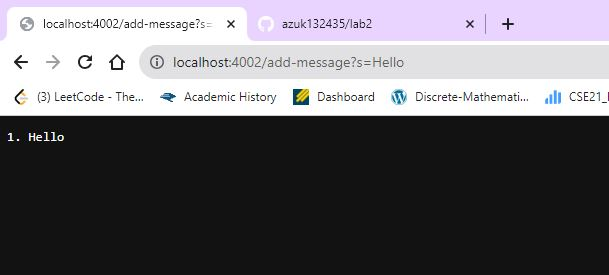
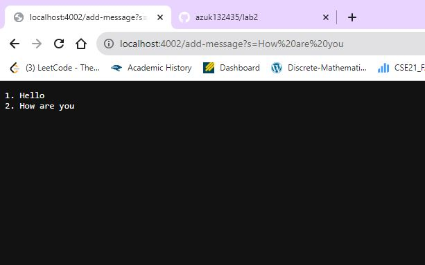
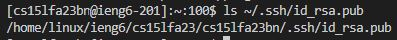
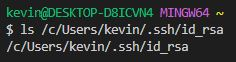
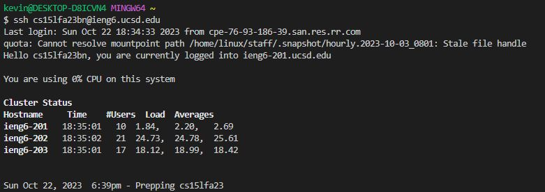

**Lab Report 2**

 
 
 

Note:For the code for StringServer I copied NumberServer and made adjustments, code is not all by myself. 

For the first screenshot first in the just Hello line the methods that are called are: the main method, creating the serving checking the port number, and then handleRequest in StringHandler, which is what deals with the code that is added after the port
using /add-message?s="whatever it is that you type". When this happens the message after s is appended onto the String in which the counter is also printed in messages.append. Here after the first run message count would increment from 0 to 1, hence it returns 1. Hello.  
For the second screenshot with both 1. Hello and 2.How are you, this time we aren't rerunning the main method code since the server is already running, we are simply adding a new message to this. So the main method is not run as it would reset the inputs. Then handleRequest
in StringHandler once again is used in which it checks for a message that is added on to ?s= which in this case would be How are you. This is now added to the stringbuilder along with the count incremented by (now becoming 2) and ultimately it returns it on 
the next line. This leaves the output 2. How are you, below the previous output of 1. Hello.  

For the main method the relevant arguments was args[0] in which we inputed our port number, for int port(this happens in the terminal 
when we make the server). In handleRequests: we had url which was what was inputed when we typed our link to view the server and prompt that we wanted to add text lines.
Messages took on the values of what we added after s =, which was effectively whatever word or line we wanted to add to our server/website.
Count started off as 0, naturally and the values relevence was it counted the number of inputs which allowed us to numerically number
each line based off when they were inputed. This holds true for both methods, with the only difference really being that if there are multiple inputs you naturally don't want to reset and re-run the main method, otherwise previous input is lost.  

In terms of what changes between the two lines for the two lines for starters is the URI as we fundamentally inputed different 
inputs when typing (hello vs how are you at the end). Also I want to mention that String[] parameters was used to take in the values of s and then what you wanted to input
and it would seperate based off that, checking for s at the [0] index and your input becoming the [1] index. Naturally count would increment each time so when we first typed hello
it got incremeted up to 1, and then to 2 after we typed how are you. Messages would be updated to whatever it is we want to print, which is the number, and what it is we wanted to display as a message.  

 
 
 

Honestly almost everything from week 2 and 3 is stuff that I didn't know prior to learning about it from lecture/lab. Like for example the idea of how we can have private and public keys and the interaction of that
allowing us to access and use external servers I think is really cool. One really cool thing prior to this that I never even considered being able to do it being able to create a server
like the one we did in this writeup that can effectively be the basis of things like blogs, discussion boards, etc. Having something updated through url is just something that was very
foreign to me that I was exposed to during week 2 and 3.

